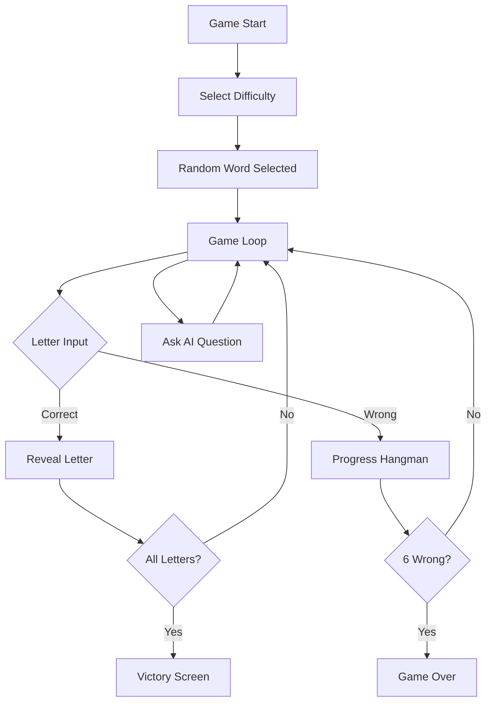

# Nuxt 4 ASCII Hangman Game

## Tech Stack

- **Nuxt 4** with TypeScript
- **Tailwind CSS 4** with custom grim color palette
- **Google Gemini API** for AI yes/no questions

## Visual Design

### Color Palette (Grim/Monochrome)

- Background: Deep charcoal (`#0d0d0d`)
- Primary text: Bone white (`#e8e8e8`)
- Accent: Muted crimson (`#8b0000`) for wrong guesses/danger
- Secondary: Ash gray (`#3a3a3a`) for UI elements
- Success: Pale green (`#4a6a4a`) for correct letters

### Typography

- Monospace font throughout (JetBrains Mono or similar) for ASCII authenticity

### ASCII Animated Background

- Subtle floating symbols: skulls, crosses, bones, fog patterns
- CSS keyframe animations for drifting/fading effect
- Low opacity to not distract from main game

### Screen Layout

```
+--------------------------------------------------+----+
|                                                  | AI |
|              ASCII BACKGROUND                    |    |
|                                                  | ?  |  <- collapsed tab
|            +---+                                 |    |
|            |   |                                 +----+
|            O   |        _ _ _ _ _ _              |    |
|           /|\  |                                 | AI |
|           / \  |                                 |SIDE|  <- expanded panel
|        =========                                 |PANE|
|                                                  |    |
|    [ Q W E R T Y U I O P ]                       |    |
|    [  A S D F G H J K L  ]                       +----+
|    [    Z X C V B N M    ]                       |
+--------------------------------------------------+----+
```

---

## Project Structure

```
hangman/
├── app/
│   ├── components/
│   │   ├── game/
│   │   │   ├── HangmanAscii.vue      # Main hangman display (6 stages)
│   │   │   ├── WordDisplay.vue        # Hidden word with revealed letters
│   │   │   └── Keyboard.vue           # On-screen keyboard
│   │   ├── ui/
│   │   │   ├── AsciiBackground.vue    # Animated grim ASCII background
│   │   │   ├── DifficultySelect.vue   # Difficulty picker
│   │   │   └── AiSidePanel.vue        # Collapsible AI help panel (right edge)
│   │   └── layout/
│   │       └── GameLayout.vue
│   ├── composables/
│   │   ├── useGame.ts                 # Game state management
│   │   ├── useKeyboard.ts             # Physical keyboard listener
│   │   └── useAi.ts                   # Gemini API integration
│   ├── data/
│   │   └── words.ts                   # Word lists by difficulty
│   ├── assets/
│   │   └── hangman-stages.ts          # ASCII art for each hangman stage
│   ├── pages/
│   │   └── index.vue                  # Main game page
│   └── app.vue
├── server/
│   └── api/
│       └── ask-ai.post.ts             # Gemini API endpoint
├── nuxt.config.ts
├── tailwind.config.ts
└── .env                               # API key storage
```

---

## Core Features

### 1. Hangman ASCII Art (6 Stages)

Predefined ASCII stages in `assets/hangman-stages.ts`:

```
Stage 0 (empty gallows) → Stage 6 (complete figure)
  +---+      +---+
  |   |      |   |
      |      O   |
      |     /|\  |
      |     / \  |
      |          |
=========  =========
```

### 2. Word Lists (`data/words.ts`)

- **Easy**: Common 4-6 letter words (apple, house, water...)
- **Medium**: 6-10 letter words (mountain, computer, elephant...)
- **Arcane**: Unusual/archaic words (eldritch, sepulchre, phantasm, tenebrous...)

### 3. Game Flow



### 4. Keyboard Input

- On-screen clickable keyboard with visual feedback
- Physical keyboard listener via `useKeyboard.ts` composable
- Letters grayed out after use (correct = green, wrong = red)

### 5. AI Yes/No Questions (Side Panel)

- **Collapsible panel on right edge** - small tab/icon to open
- Non-intrusive design, doesn't obstruct main gameplay
- Positioned as secondary/optional feature (future premium potential)
- When expanded:
  - Input field for player questions
  - Question history with responses
  - Typing animation for AI response
- Server API route calls Gemini with context:
  - The secret word
  - Player's question
  - Instruction to answer only yes/no

---

## Implementation Order

1. Initialize Nuxt 4 project with Tailwind 4
2. Set up color palette and typography in Tailwind config
3. Create ASCII hangman stages data
4. Create word lists (Easy, Medium, Arcane)
5. Build core game composable (`useGame.ts`)
6. Create UI components (background, hangman, word display)
7. Implement keyboard (on-screen + physical)
8. Build difficulty selection screen
9. Create Gemini API server route
10. Implement AI question feature
11. Add animations and polish
